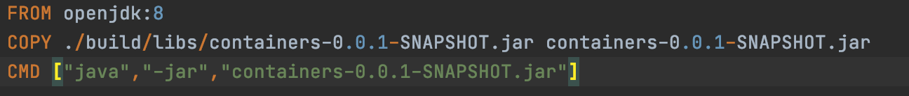
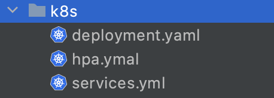

# Docker and Kubernetes Workshop

Micro servicio que expone un API REST

[ Base URL: localhost:9090 ]

### API Client
Api que permite registar un cliente en la base de datos

__POST__ /clientes/adicionarCliente

__REQUEST__
~~~
{
    "cedula":"",
    "primerNombre":"kubernetes",
    "primerApellido":"k8s",
    "cuentaDto":{
        "id":"2",
        "tipoCuenta":"ahorros",
        "numeroCuenta":"123456789"
    }
}  
~~~

__RESPONSE__
~~~
{
    "codigoHttp": "200",
    "mensajeExito": "Registrado insertado exitosamente"
}
~~~

## DOCKERFILE

| Etiqueta  | Descripción |
|  ------- | ---------- |
| FROM     | Especificamos la imagen de docker a utilizar  |
| COPY     | Copiamos archivos en la imagen Docker  |
| CMD      | Permite ejecutar comandos |

### COMANDOS DOCKER

| Comandos                         | Descripción |
| -------------------------------- | ---------- |
| docker build -t taller-docker .  | Generamos imagen docker apartir del dockerfile  |
| docker images                    | Listar imagenes Docker  |
| docker run -d -p 80: taller-docker      | Creamos un contenedor a partir de la imagen Docker   |

## KUBERNETES
En la carpeta k8s vamos a encontrar tres archivos

#### Deployment
Nos permite definir diferentes funciones: Control de réplicas. Escabilidad de pods.

#### HPA
El HPA de Kubernetes nos permite variar el número de pods desplegados mediante un replication controller o un deployment en función de diferentes métricas.

#### Services
Un servicio de Kubernetes agrupa un conjunto de pods y proporciona una conexión de red a estos pods. El servicio selecciona los pods de destino a los que direcciona el tráfico, a través de etiquetas

### COMANDOS K8'S

| Comandos                         | Descripción |
| -------------------------------- | ----------- |
| kubectl apply -f deployment.yaml |  |
| kubectl apply -f services.yaml   |  |
| kubectl apply -f hpa.yaml        |  |

### CREAR BD

en la ruta 
``src/main/resources/create_bd.sql`` 
se encuentran los script para recrear la BD mySQL
